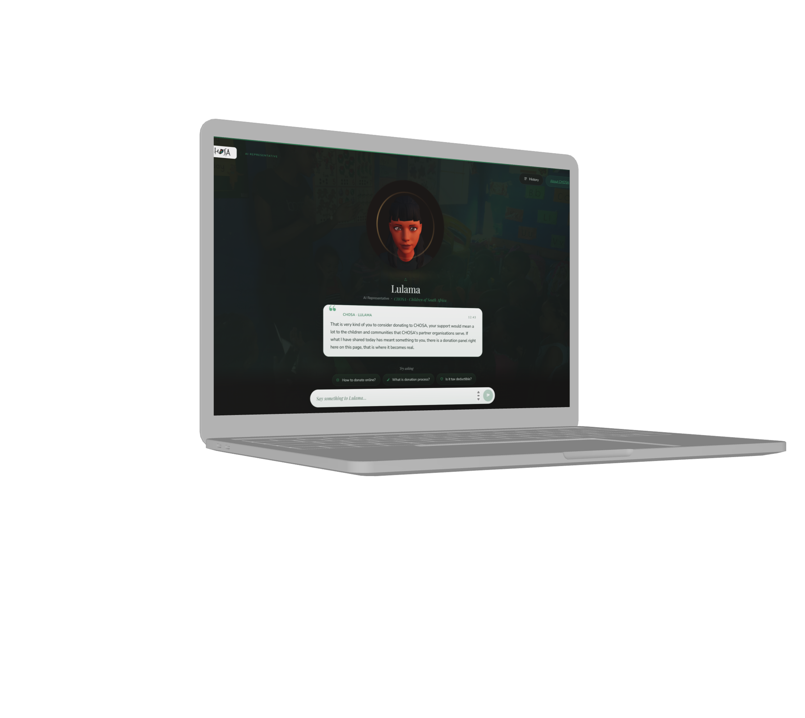
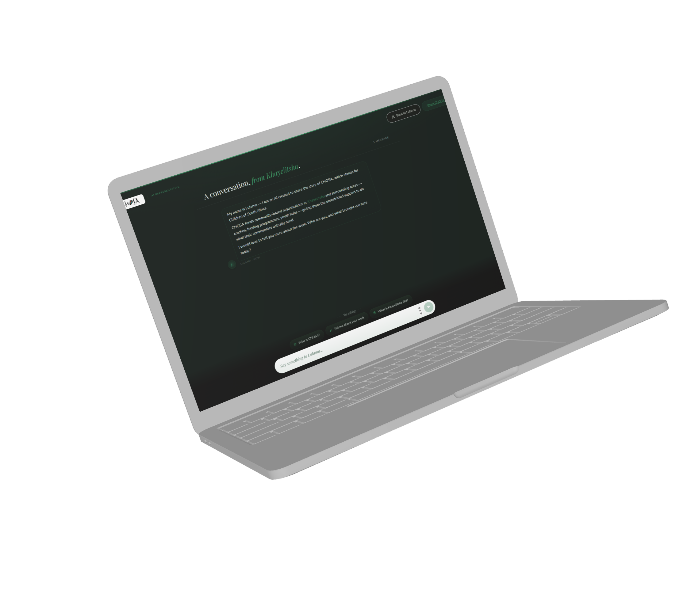
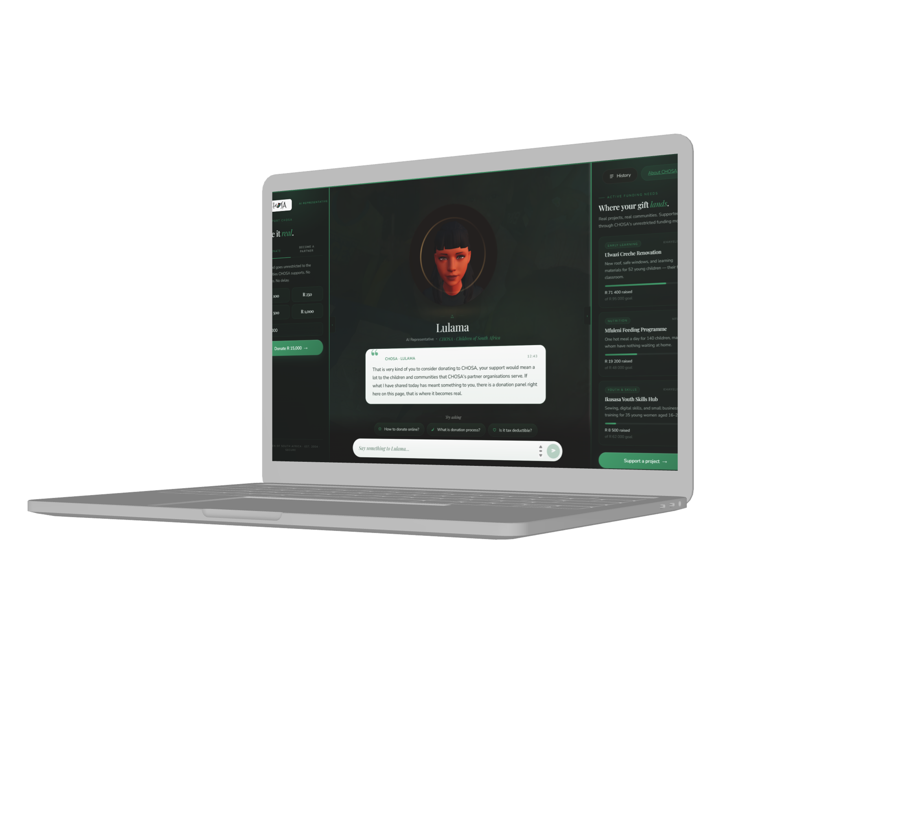
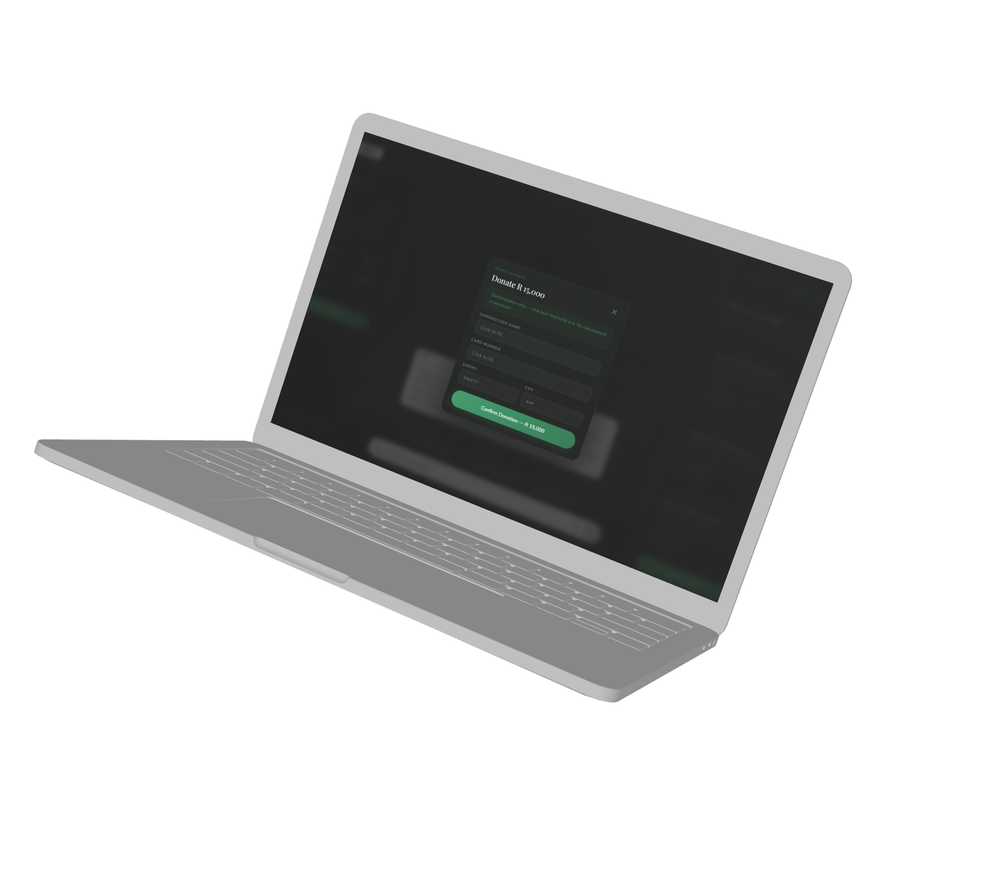

<div align="center">


# Lulama — CHOSA AI Representative

A 3D conversational AI experience built for [CHOSA (Children of South Africa)](https://www.chosa.org).
Lulama is a purpose-built AI representative that shares CHOSA's story, builds emotional connection with visitors, and guides them toward meaningful support.


</div>

<br/>

## Table of Contents

1. [Overview](#overview)
2. [Screens](#screens)
3. [Features](#features)
4. [Tech Stack](#tech-stack)
5. [Getting Started](#getting-started)
6. [Environment Variables](#environment-variables)
7. [Project Structure](#project-structure)
8. [Adding Community Photos](#adding-community-photos)
9. [Updating CHOSA Projects](#updating-chosa-projects)
10. [Customising the AI Persona](#customising-the-ai-persona)
11. [Roadmap](#roadmap)
12. [Acknowledgements](#acknowledgements)
13. [Author](#author)
14. [License](#license)

<br/>

---

## Overview

Lulama is a purpose-built AI experience for CHOSA, a South African nonprofit that has funded and strengthened community-based organisations in the Western Cape since 2004. Rather than a static landing page, visitors encounter a 3D animated avatar that holds a real conversation, shares CHOSA's impact, and when the moment is right, opens a donation panel directly in the interface.

The system is designed around three core ideas.

**Honest transparency.** Lulama identifies itself as an AI from the first message. It speaks on behalf of CHOSA, not as a pretend community worker.

**Emotional storytelling.** The conversation arc moves from connection to story to a direct, warm donation ask — guided by a large language model instructed through the system prompt to stay on topic and stay truthful.

**Frictionless giving.** The donation panel appears exactly when it should: the moment a user expresses interest in giving, or when Lulama naturally reaches the ask. Users can pick a preset amount, enter a custom amount, and complete a demo payment flow without leaving the page.

<br/>

---

## Screens

<br/>

### Avatar View

<div align="center">
  
</div>

<br/>

The main view presents Lulama as a 3D animated character rendered in a WebGL canvas. The avatar responds to each message with realistic lip sync driven by per-character viseme mapping, ambient head movement, idle breathing, and natural blinking. A speech bubble typewriters the response below. Clicking the bubble at any point completes the text instantly so the user does not have to wait.

<br/>

### Chat History View

<div align="center">
  
</div>

<br/>

Switching to History mode replaces the avatar stage with a full conversation transcript. Both modes share the same input composer and the same dynamic quick-reply chips, which regenerate after every AI turn to reflect contextually relevant follow-up questions for that specific exchange.

<br/>

### Full Layout — Donation Panel and Funding Panel

<div align="center">
  
</div>

<br/>

On desktop the layout splits into three columns. The funding panel on the right displays CHOSA's active fundraising projects with animated progress bars. The donation panel on the left slides in when the conversation reaches the support phase, or immediately when a user asks about giving. Both panels can be opened and closed independently via the tab buttons on their inner edges.

<br/>

### Payment Modal

<div align="center">
  
</div>

<br/>

Clicking Donate opens a full-viewport modal centred over the interface. Each field starts blank and auto-types a demo card detail when the user clicks into it, illustrating how a real payment integration would behave. This is a demonstration flow only. No real transaction is processed.

<br/>

### Donation Confirmed

<div align="center">
  
</div>

<br/>

Confirming the demo donation replaces the form with an animated success state. The modal closes automatically after a short delay and the user is returned to the conversation.

<br/>

---

## Features

| Feature | Detail |
| --- | --- |
| 3D Animated Avatar | Ready Player Me GLB model rendered with Three.js and React Three Fiber |
| Lip Sync | Per-character ARKit viseme mapping at 45 ms per character, synced precisely to the typewriter |
| AI Conversation | Groq API running LLaMA 3.3 70B via an OpenAI-compatible client |
| Dynamic Quick Replies | Each AI response triggers a secondary Groq call that generates contextually relevant follow-up chips |
| Donation Panel | Preset amounts, custom amount input, demo payment modal with auto-type fields |
| Partner Registration | Inline multi-step registration form with a success confirmation state |
| Funding Panel | Three active CHOSA projects with animated progress bars and live raise figures |
| Background Gallery | Subtle Ken Burns photo slideshow at 9% opacity using real community images |
| Click to Skip | Clicking the speech bubble during typewriting completes the response instantly |
| Panel Toggles | Both side panels open and close independently via floating edge tab buttons |
| CHOSA Brand Aligned | Nunito body font, Playfair Display headings, CHOSA forest green palette throughout |
| Fully Responsive | Three-column layout on desktop collapses to a single-column stack on mobile |

<br/>

---

## Tech Stack

**Frontend**

| Library | Version | Purpose |
| --- | --- | --- |
| React | 19 | UI component framework |
| Vite | 8 | Build tool and development server |
| Three.js | 0.174 | WebGL 3D rendering engine |
| @react-three/fiber | 9 | React renderer for Three.js |
| @react-three/drei | 10 | Three.js scene helpers and model loader |
| openai | latest | Groq API client using OpenAI-compatible interface |

<br/>

**APIs**

| Service | Purpose |
| --- | --- |
| Groq — llama-3.3-70b-versatile | Main AI conversation and dynamic prompt chip generation |

<br/>

**Design**

| Asset | Detail |
| --- | --- |
| Nunito | Body and label typography via Google Fonts |
| Playfair Display | Display headings via Google Fonts |
| CHOSA green #3D9E6B / #2D7A52 | Primary brand colour applied across all interactive elements |
| CSS custom properties | Full design token system with panel width, spacing, and colour variables |

<br/>

---

## Getting Started

### Prerequisites

You will need the following before running the project.

* Node.js 18 or higher
* A free Groq API key obtained from [console.groq.com](https://console.groq.com) (no credit card required)

### Installation

Clone the repository and install dependencies.

```bash
git clone https://github.com/Armand1711/Theme-Two-Project.git
cd Theme-Two-Project/lulama
npm install
```

Copy the example environment file.

```bash
cp .env.example .env
```

Open `.env` and paste your Groq API key.

```env
VITE_GROQ_API_KEY=your_groq_key_here
```

Start the development server.

```bash
npm run dev
```

The app runs at `http://localhost:5173`.

### Production Build

```bash
npm run build
npm run preview
```

<br/>

---

## Environment Variables

| Variable | Required | Description |
| --- | --- | --- |
| `VITE_GROQ_API_KEY` | Yes | Groq API key for the LLaMA conversation and prompt generation model |
| `VITE_ELEVENLABS_API_KEY` | No | ElevenLabs key for voice TTS — browser speech is used as a fallback if this is empty |
| `VITE_ELEVENLABS_VOICE_ID` | No | ElevenLabs voice ID — defaults to the Charlotte voice |

<br/>

---

## Project Structure

```text
lulama/
├── public/
│   ├── models/
│   │   └── brunette.glb             # Ready Player Me avatar model
│   ├── gallery/
│   │   └── photo-01.jpg…photo-09.jpg  # Background community photos
│   └── chosa-logo.png               # CHOSA brand logo
├── src/
│   ├── components/
│   │   └── Avatar.jsx               # 3D avatar, lip sync, viseme engine
│   ├── App.jsx                      # All UI components and application logic
│   ├── index.css                    # Complete design system and layout
│   └── main.jsx                     # React entry point
├── docs/
│   └── mockups/                     # README screenshots
├── .env.example
└── index.html
```

<br/>

---

## Adding Community Photos

The background gallery rotates through images placed in `/public/gallery/`. Name each file `photo-01.jpg` through `photo-09.jpg`. The component detects which files are present and silently skips any that are missing, so photos can be added one at a time. Each image displays at 9% opacity with a slow Ken Burns pan, providing subtle environmental texture without distracting from the conversation.

<br/>

---

## Updating CHOSA Projects

The funding panel data lives in the `PROJECTS` array near the top of `src/App.jsx`. Each entry follows this shape.

```js
{
  id: 1,
  name: 'Ulwazi Creche Renovation',
  location: 'Khayelitsha',
  description: 'New roof, safe windows, and learning materials for 52 young children.',
  goal: 95000,
  raised: 71400,
  tag: 'Early Learning',
}
```

Update the `raised` value at any time to reflect current fundraising progress. The progress bar percentage and display figure calculate automatically from `raised` and `goal`.

<br/>

---

## Customising the AI Persona

Lulama's behaviour is controlled entirely through the `SYSTEM_PROMPT` constant in `src/App.jsx`. The prompt defines what she knows about CHOSA, what she will never fabricate, how she speaks, and when to make the donation ask. Editing this string is the primary way to adjust tone, add new talking points, or change the conversation arc.

The `INITIAL_MESSAGE` object controls the first message Lulama delivers when the page loads. This is also injected into every subsequent API call as context so the model always understands where the conversation began.

<br/>

---

## Roadmap

The following improvements are planned for future releases.

Real payment integration via PayFast or Stripe for South African card processing.

ElevenLabs voice TTS so Lulama speaks each response as the text appears.

CMS integration so CHOSA staff can update project data and the AI prompt without touching code.

Mobile-optimised avatar mode with a reduced canvas size and lower rendering load.

Full accessibility audit covering screen reader support and keyboard navigation throughout the interface.

<br/>

---

## Acknowledgements

Built for CHOSA (Children of South Africa). Their mission to fund and strengthen community-based organisations in the Western Cape since 2004 is what this project exists to support.

Learn more at [chosa.org](https://www.chosa.org).

<br/>

---

## Author

**Armand** 

Built as part of the PP 410 final portfolio at the Cape Peninsula University of Technology.

<br/>

---

## License

This project is provided for educational and portfolio purposes. The CHOSA name, logo, and brand assets belong to Children of South Africa and are used with acknowledgement of their organisation.
